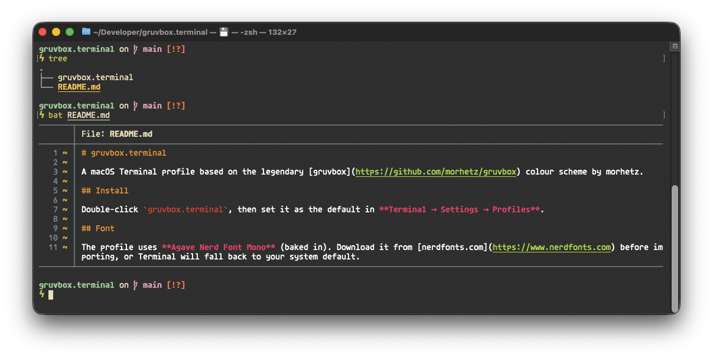

# gruvbox.terminal

A macOS Terminal profile based on the legendary [gruvbox](https://github.com/morhetz/gruvbox) colour scheme by morhetz.

## Install

Double-click `gruvbox.terminal`, then set it as the default in **Terminal → Settings → Profiles**.

## Font

The profile uses **Agave Nerd Font Mono** (baked in). Download it from [nerdfonts.com](https://www.nerdfonts.com) before importing, or Terminal will fall back to your system default.
